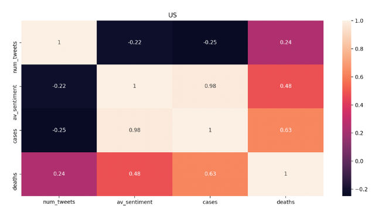

###### Scope

A home project created during Covid-19 to explore how country leaders may have been impacted by the virus by:

1. Analysing the Sentiment of tweets of the leaders of English speaking countries.
In addition to using nltk vader's SentimentIntensityAnalyzer I'll be creating a completely independent custom sentiment analyser.0
Sentiment of a tweet will be considered either Positive (+1), Neutral (0) or Negative (-1)
and the sentiment score for a day will be average of the sentiment from all tweets from the leader on that day.

2. Calculating the correlation of a leader's tweets on a particular day with the number of new covid cases & new covid deaths on that day.

###### Sources of Data:

To build a corpus for training my custom sentiment analyser I'll use an equal number of Positive, Neutral & Negative tweets from the following datasets:
* The International Workshop on Semantic Evaluation dataset (SemEval).
* Kaggle Airline Sentiment dataset.
* A random set of manually labelled leader tweets by myself.

(Kaggle's sentiment140 dataset was not used as it does not include tweets classified as neutral).

For the Timeseries of Covid cases on days I'll use the dataset:
* Novel Coronavirus (COVID-19) Cases, provided by JHU from https://github.com/CSSEGISandData/COVID-19.

###### Program Flow:

The requirements.txt specifies all the external modules needed to install into your virtual environment to run the code.

Each component is defined as a class and encapsulates any functionality appropriately.

The Orchestrator has responsibility for creating and sequencing the components used.

An abstract base class is used to share re-usable functionality concerning handling file operations. 
Otherwise, dependencies are passed into constructors. unittest was used for minimal testing in checking helper functions behaved correctly.  
To allow reproducible results, seeds are set for all pseudo random generators at the start and seeds are passed into any sklearn methods.

###### Data Prep:

Different values for the following were trialed when creating the training corpus...
* Stop words appropriate to each training dataset.
* Data cleaning to remove hyperlinks, mentions, html etc.
* Replacement of emojis and emoticans with word equivalents.
* Minimum word length.
* The stemmer or lemmatiser used. 
* The vectorisation approach (e.g. tf-idf) used for building the documentation matrix.

The CorpusManager for building a corpus for training the custom Sentiment Analyser.

###### Model Training:
The test set was not used in building the training corpus to avoid any data leakage and undermining of results.

My custom sentiment analyser used a Randomized Search with Cross Validation (sklearn's RandomizedSearchCV) to explore various hyperparameters for:
* a Logistic Regression classifier.
* a Multinomial Naive Bayes classifier.
* a Random Forest classifier.

The best model was found to be:

_LogisticRegression(C=0.001, class_weight=None, dual=False, fit_intercept=True,
                   intercept_scaling=1, l1_ratio=None, max_iter=100,
                   multi_class='auto', n_jobs=None, penalty='l2',
                   random_state=None, solver='liblinear', tol=0.0001, verbose=0,
                   warm_start=False)_

The CustomSentimentAnalyser class encapsulates functionality for training.

###### Comparison of my custom sentiment analyser:

Model performance was evaluated using:
* printouts of the classification report
* plots of the confusion matrix
* plots of the Area Under the ROC curve for each classification (Positive, Neutral or Negative against the others)
(Seaborn and Matplotlib used for the plots.)
* printouts of the text from a random set of misclassified tweets.

My custom sentiment analyser:

 was found to be significantly more accurate than nltk vader's SentimentIntensityAnalyzer.

In both cases, Neutral tweets are the most misclassified (The confusion matrix for the custom analyser below) 

###### Curation of leader tweet data:

The 'python-twitter' api package was used to retrieve tweets, specifically, the GetUserTimeline method was used to retrieve the tweets from ['@realDonaldTrump', '@LeoVaradkar', '@BorisJohnson'].
The 'since_id' and the 'max_id' fields were used to supplement the tweets stored locally as per Twitter's api instructions.
Data was filtered to include only tweets on or after 22nd Jan 2020 in order to match the same timeframe as the covid timeseries data.
You'll need to request your own Twitter API keys to gather the data.

###### The Ultimate Dataframe:

Various grouping and aggregation of data from various sources allows a pandas dataframe to be created for each country: 
where the index is the calendar day and there are columns for:
* Number of tweets from country leader on that day.
* Average sentiment from all leader's tweets on that day.
* The number of new covid cases on that day.
* The number of new covid deaths on that day.

###### Results of Sentiment to Covid Correlations:

The sentiment of Trump's tweets are strongly positively correlated with the number of new cases on a day (twice as strongly as with the number of deaths).
i.e. the more new cases in the US, the more positive the sentiment in Trump's tweets!

###### Possible Project Extensions:

* Compare with sentiment analysis from Facebook's Fasttext library.
* Try using Bigrams & Trigrams when building the training corpus.
* Extend the training data to have more examples of labelled tweets from politcal leaders.

